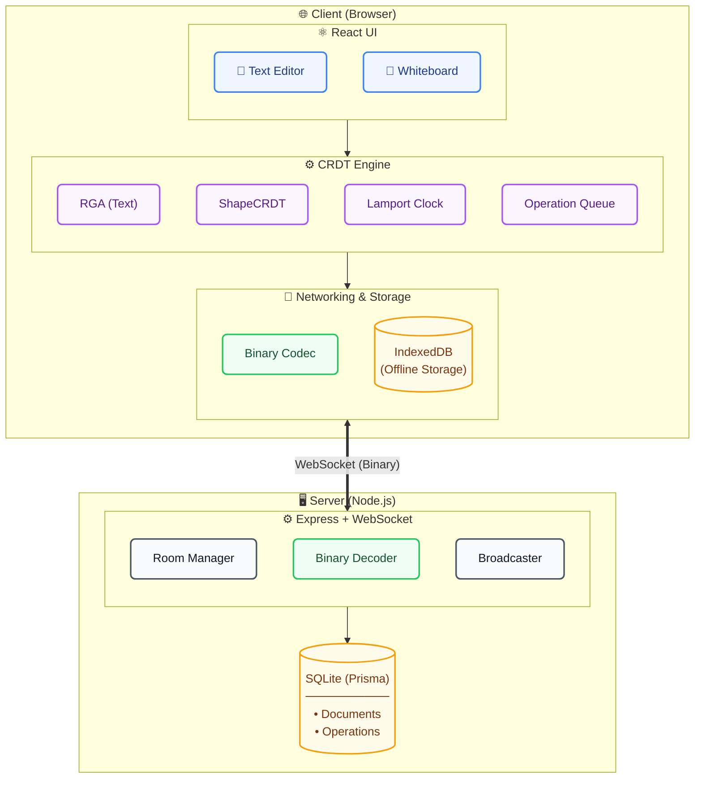

# Canvas_Sync – Collaborative Text + Whiteboard Editor

**Live Demo:** [https://canvassync-frontend.onrender.com](https://canvas-synccanvassync-frontend.onrender.com)

---


## Collaborative Editor Architecture




## 🚀 What is this?

Canvas_Sync is a **real-time collaborative editor** where multiple people can edit the same document and draw shapes together – all synced instantly.

Unlike Google Docs, this uses **CRDTs** (Conflict-Free Replicated Data Types), which means:
- ✅ No central server needed for conflict resolution
- ✅ No merge conflicts – ever
- ✅ Works offline – edits sync when you reconnect

---

## ✨ Features

- **Text Editor** – Type together in real time
- **Whiteboard** – Draw shapes (rectangles, circles, lines) that sync instantly
- **Offline Support** – Edits are saved locally and sync when you reconnect
- **Undo/Redo** – Ctrl+Z / Ctrl+Shift+Z
- **Binary Protocol** – 85% less bandwidth compared to JSON
- **Docker Ready** – One command to run everything

---

## 🛠️ Tech Stack

| Layer | Technology |
|-------|------------|
| Frontend | React + TypeScript + Vite + Tailwind CSS |
| CRDT Engine | Custom RGA (built from scratch) |
| Backend | Node.js + Express + WebSocket |
| Database | SQLite + Prisma |
| Whiteboard | Fabric.js |
| Deployment | Docker + Render |

---

## 🚀 How to Run Locally

### 1. Clone the repository
```bash
git clone https://github.com/thapasubashb/Canvas_Sync.git
cd Canvas_Sync


2. Start the frontend
bash
npm install
npm run dev
3. Start the backend (in a new terminal)
bash
cd server
npm install
npm run dev
4. Open your browser
text
http://localhost:3000
🐳 Run with Docker (One Command)
bash
docker compose up --build
Then open http://localhost:3000

📁 Project Structure
text
Canvas_Sync/
├── src/              # Frontend (React + TypeScript)
├── server/           # Backend (Node.js + WebSocket)
├── Dockerfile        # Frontend container
├── docker-compose.yml # Multi-container setup
└── README.md         # This file
📊 Key Metrics
Metric	Value
Bandwidth Reduction	85% vs JSON
Operation Latency	Sub-100ms
Concurrent Users	50+
Merge Conflicts	0 (zero)
🧠 How It Works
Every character and shape has a unique ID with a Lamport timestamp

Edits are ordered causally – no conflicts

Deleted items become tombstones – nothing is ever removed

When two users edit, their changes merge automatically

👨‍💻 About Me
GitHub: thapasubashb

LinkedIn: B . Subash

Instagram: Subash._.10

📄 License
MIT © 2026 Subash Thapa